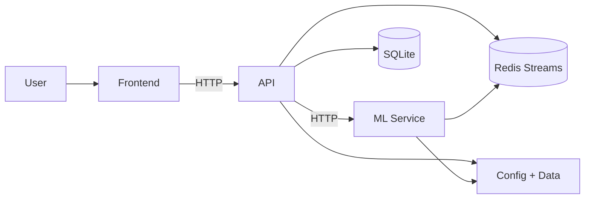

# Jobato

Jobato is a daily, personalized job discovery tool for senior and lead software engineers. It runs allowlisted searches across job platforms and uses relevance scoring to surface the most relevant new postings without paywalls.

## Tech Stack

- Frontend: Vite + React + TypeScript, React Router 7.13.0, TanStack Query 5.90.20, react-window 2.2.6
- API: Spring Boot 4.0.2.RELEASE (Java 17), SpringDoc 3.0.1, Flyway 12.0.0, Micrometer 1.16.2
- ML: FastAPI (Python 3), SQLAlchemy 2.0.46, Alembic 1.18.3, prometheus-client 0.24.1
- Data and Messaging: SQLite 3.51.2, Redis Streams (Redis 8.4)

## Quickstart

### Docker Compose (all services)

1. Copy `.env.example` to `.env` and update values as needed.

   ```bash
   cp .env.example .env
   ```

2. Start all services.

   ```bash
   docker compose up --build
   ```

Service endpoints:

- Frontend: http://localhost:5173
- API: http://localhost:8080/api
- ML: http://localhost:8000
- Redis: localhost:6379

To stop services:

```bash
docker compose down
```

### Run services locally

Service env files:

- `frontend/.env.example`
- `api/.env.example`
- `ml/.env.example`

#### Frontend

```bash
cd frontend
npm install
npm run dev
```

#### API

```bash
cd api
./gradlew bootRun
```

#### ML

```bash
cd ml
pip install -r requirements.txt
uvicorn app.main:app --host 0.0.0.0 --port 8000
```

## Architecture

Diagram: The frontend calls the API; the API coordinates the ML service, persists data in SQLite, and both services use Redis and shared config/data.



## Repository Layout

- `frontend/` - React UI for reviewing daily job leads and giving relevance feedback
- `api/` - Spring Boot API for configuration, orchestration, and data access
- `ml/` - FastAPI service for relevance scoring and model training
- `config/` - Configuration files and templates
- `data/` - Local data assets
- `infra/` - Infrastructure resources
- `scripts/` - Local development and ops scripts
- `docker-compose.yml` - Local multi-service orchestration

## Frontend

The frontend provides the UI to review job results, manage queries and allowlists, and capture relevance feedback.

Docs: `frontend/README.md`

### Structure

- `frontend/src/app` - App shell and routing
- `frontend/src/features` - Feature modules and server-query hooks
- `frontend/src/styles` - Shared styles and tokens
- `frontend/src/assets` - Static assets
- `frontend/src/test` - Test setup and utilities

## API

The API provides REST endpoints for configuration, data access, and coordination between the UI and ML service.

### Structure

- `api/src/main/java/com/jobato/api/controller` - HTTP controllers
- `api/src/main/java/com/jobato/api/service` - Business logic
- `api/src/main/java/com/jobato/api/repository` - Data access
- `api/src/main/java/com/jobato/api/dto` - Request and response DTOs
- `api/src/main/java/com/jobato/api/model` - Domain models
- `api/src/main/java/com/jobato/api/config` - Service configuration
- `api/src/test/java` - Tests

## ML

The ML service scores job postings for relevance and manages model training and inference.

### Structure

- `ml/app/main.py` - FastAPI application entrypoint
- `ml/requirements.txt` - Python dependencies
- `ml/.env.example` - Environment configuration template

## Usage Examples

### API

List queries:

```bash
curl http://localhost:8080/api/queries
```

Create a query:

```bash
curl -X POST http://localhost:8080/api/queries \
  -H "Content-Type: application/json" \
  -d '{"text":"site:greenhouse.io \"senior backend\" remote"}'
```

Update a query:

```bash
curl -X PATCH http://localhost:8080/api/queries/<id> \
  -H "Content-Type: application/json" \
  -d '{"enabled":false}'
```

List allowlisted domains:

```bash
curl http://localhost:8080/api/allowlists
```

Add an allowlisted domain:

```bash
curl -X POST http://localhost:8080/api/allowlists \
  -H "Content-Type: application/json" \
  -d '{"domain":"example.com"}'
```

Update an allowlisted domain:

```bash
curl -X PATCH http://localhost:8080/api/allowlists/example.com \
  -H "Content-Type: application/json" \
  -d '{"enabled":false}'
```

If your environment enforces API keys, add `-H "X-Jobato-Api-Key: <value>"` to the curl commands above.

### ML

Health check:

```bash
curl http://localhost:8000/health
```
