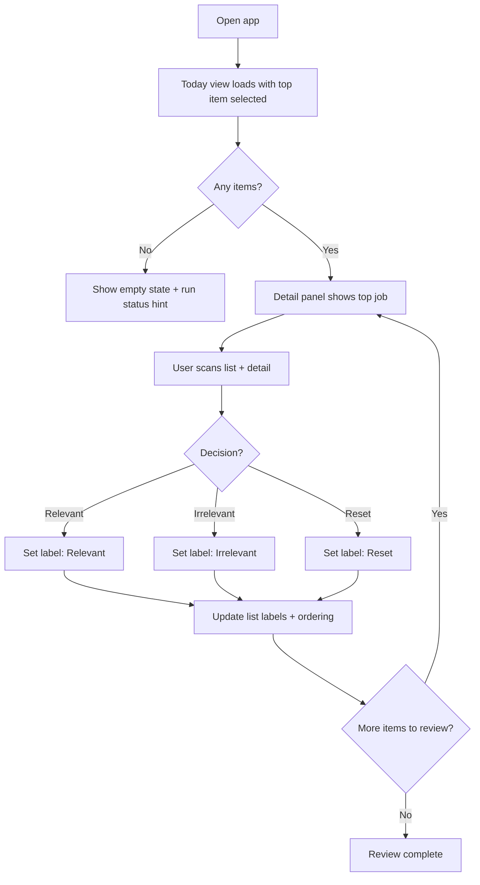
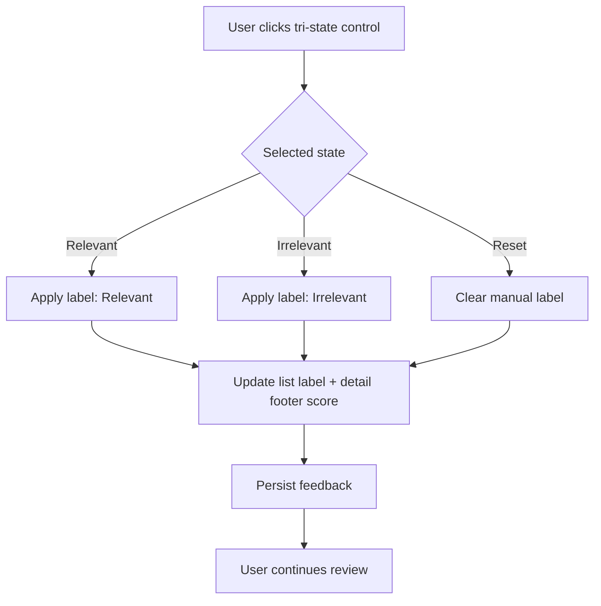

# UX Design Specification {{project_name}}

**Author:** {{user_name}}
**Date:** {{date}}

---

<!-- UX design content will be appended sequentially through collaborative workflow steps -->

## Executive Summary

### Project Vision

Jobato is a local-first web app that runs Google-based job discovery over allowlisted sites and surfaces the most relevant new roles daily. The UX must minimize time spent evaluating posts while enabling quick relevance feedback to improve future results.

### Target Users

Senior and lead software engineers who are time-constrained, tech-savvy, and want a fast, reliable way to review new job opportunities with minimal noise. Primary usage is likely on desktop/laptop during a brief daily review window.

### Key Design Challenges

- Build trust in relevance quickly without overwhelming users with detail.
- Enable fast scanning of results while keeping context (title, company, snippet, date).
- Keep "irrelevant" items visible but clearly de-emphasized.
- Provide clear run status and error states (quota reached, zero results).

### Design Opportunities

- A "daily ritual" review experience that feels fast and focused.
- Strong visual hierarchy for "Today" results with clear relevance cues.
- One-click feedback loops to improve relevance over time.
- Clear empty-state and recovery guidance when results are sparse.

## Core User Experience

### Defining Experience

The core loop is a fast daily review: check new jobs and label each as relevant or irrelevant to improve future results.

### Platform Strategy

Web browser on laptop, optimized for mouse/keyboard interactions. No mobile or desktop app requirements.

### Effortless Interactions

- Toggle irrelevant jobs on/off in the list view.
- Mark a job as relevant/irrelevant with a single action.
- Scan the top results quickly with clear hierarchy and minimal noise.

### Critical Success Moments

- The day the top five jobs surfaced are all relevant.

### Experience Principles

- Fast daily review over deep browsing.
- Feedback-first: labeling is the primary action.
- Clarity over density: show only what’s needed to decide.
- Trust through consistency: the same actions always yield predictable outcomes.

## Desired Emotional Response

### Primary Emotional Goals

- Motivated to review and act on new jobs quickly.

### Emotional Journey Mapping

- Discovery: motivated to try a focused daily review.
- Daily review: motivation is sustained by a fast, low-friction scan.
- After labeling: optimistic about improved results tomorrow.
- Success moment: thrilled when the top five jobs are all relevant.
- If something goes wrong: avoid frustration with clear status and recovery cues.

### Micro-Emotions

- Sustained motivation during scanning.
- Short bursts of thrill when high-fit roles appear.
- Optimism after feedback is applied.

### Design Implications

- Emphasize a fast, focused list view to keep motivation high.
- Use clear relevance cues to create moments of thrill quickly.
- Make labeling instantaneous to reinforce optimism.
- Use explicit run status and empty states to avoid frustration.

### Emotional Design Principles

- Motivation first: keep the daily review short and focused.
- Optimism after feedback: show that labeling improves outcomes.
- Thrill at the top: highlight the highest-fit results early.
- No frustration: clear states, clear next steps.

## UX Pattern Analysis & Inspiration

### Inspiring Products Analysis

**Tinder**

- Strengths: fast overview, one clear decision action, minimal cognitive load per item.
- Value for jobato: supports quick daily review with a simple relevant/irrelevant decision.

### Transferable UX Patterns

- **Card/list with a single primary action** -> translate swipe/decision into one-click relevant/irrelevant.
- **Clear visual hierarchy** -> headline + snippet upfront to speed judgment.
- **Momentum-driven flow** -> keep users in a quick review rhythm without extra steps.

### Anti-Patterns to Avoid

- Overly complex filter and search configuration in the UI.
- Deep nested filtering and advanced fields (e.g., mobile.de-style systems).

### Design Inspiration Strategy

**Adopt**

- Single, obvious decision action per item.
- Fast scan pattern: title -> company -> snippet.

**Adapt**

- "Swipe" decision pattern into keyboard/mouse-friendly controls.

**Avoid**

- Complex filtering interfaces and heavy configuration in the UI.

## Design System Foundation

### 1.1 Design System Choice

Themeable component system (speed-first, with light branding).

### Rationale for Selection

- Fast to implement for a solo developer.
- Solid, accessible defaults with predictable components.
- Enough theming flexibility to create a focused, distinct UI without heavy custom design work.

### Implementation Approach

- Start with a themeable component library as the base.
- Use a small set of layout and list components to keep the UI consistent.
- Limit custom components to the job card/list item and run status summary.

### Customization Strategy

- Minimal branding: typography + color accents for relevance cues.
- Clear hierarchy for "Today" results and top-fit items.
- Subtle styling for de-emphasized irrelevant items.

## 2. Core User Experience

### 2.1 Defining Experience

"Tinder for job hunting" - a rapid, decision-first review of new roles where the best fits surface first and feedback is instant.

### 2.2 User Mental Model

Inbox triage meets Tinder-like quick decisions (no swipe required). Users expect a ranked list, fast scanning, and one-click feedback.

### 2.3 Success Criteria

- Top relevant jobs are visually and structurally obvious in the list.
- Correcting model suggestions is frictionless (override a -1 or +1 instantly).
- Daily review feels fast enough to complete in a few minutes.

### 2.4 Novel UX Patterns

Established patterns with a familiar twist: ranked list + quick decision actions.

### 2.5 Experience Mechanics

1. **Open:** User lands on Today view with the highest-ranked job selected by default.
2. **Scan:** Left panel shows a relevance-sorted list; active job is highlighted.
3. **Decide:** User clicks a single CTA to mark Relevant / Irrelevant / Reset.
4. **Feedback:** Score/label updates immediately and the list reorders or marks state.
5. **Continue:** User moves down the list, repeating the quick decision flow.

## Visual Design Foundation

### Color System

Theme A: Sandstone + Pine (warm calm, optimistic)

- Background: #F7F3EE
- Surface: #FFFFFF
- Text: #1E1B16
- Muted text: #6B6259
- Accent (actions): #2F5E4E
- Success/relevant: #1F7A5E
- Warning: #C9823C
- Danger/irrelevant: #B35A4A
- Border: #E3D9CF

Semantic mapping:

- Primary actions: Accent
- Success: Relevant
- Warning: Quota/empty-state attention
- Danger: Irrelevant / critical errors

### Typography System

- Headings: Sora (modern, friendly)
- Body: Manrope (clean, readable)
- Scale: 28 / 22 / 18 / 16 / 14
- Line-height: 1.4-1.6 for readability

### Spacing & Layout Foundation

- Base spacing unit: 8px (4px sub-steps)
- Balanced density for fast scanning
- Layout: 12-column grid; left list ~320-360px, right detail panel flexible
- Consistent vertical rhythm in list rows and detail panel

### Accessibility Considerations

- Maintain WCAG AA contrast ratios for text and key UI elements.
- Use color + text/shape to distinguish relevance states.

## Design Direction Decision

### Design Directions Explored

Six directions explored in `ux-design-directions.html` using Theme A (Sandstone + Pine): Split Triage, Focus Stack, Grid Overview, Compact Ledger, Carousel Review, and Zen Focus.

### Chosen Direction

**Direction 1: Split Triage** - a left ranked list with a focused detail panel.

### Design Rationale

- Best supports the daily triage workflow and "Tinder for job hunting" mental model.
- Keeps list scanning fast while allowing deeper context on the selected role.
- "Top fit" and "Strong" labels create confidence without adding cognitive load.

### Implementation Approach

- Two-pane layout: left list + right detail panel.
- Ranked list shows labels only ("Top fit", "Strong"), no numeric score in the list.
- Numeric score appears only in the detail footer (with run status metadata).
- Replace multi-button CTA with a single tri-state action control (Relevant / Irrelevant / Reset) with one clear active state and one-click state changes.
- Keep irrelevant toggle and run summary visible but secondary.

## User Journey Flows

### Journey 1: Daily Review (Today list)

**Goal:** Rapidly review new jobs with top fit pre-selected.

### Journey 2: Labeling / Feedback Loop (Tri-state control)

**Goal:** One-click feedback that updates the model state and list.

### Journey Patterns

- Default focus on top-ranked job with list highlight.
- Single tri-state feedback control with one active state.
- List shows labels only ("Top fit", "Strong"), numeric score appears in detail footer.
- Immediate feedback updates list labels and ordering.

### Flow Optimization Principles

- Reduce steps to value: open -> decide -> next.
- Keep feedback frictionless: one control, immediate state update.
- Maintain momentum: always keep a focused item in view.
- Avoid cognitive overload: hide numeric scores in list; emphasize labels.

## Component Strategy

### Design System Components

Use the themeable system for foundation components:

- Layout: grid, panels, containers, dividers
- Navigation: tabs, pills
- Buttons: primary/secondary
- Badges/chips
- Toggle/switch
- Typography scale and spacing tokens
- Status text styles

### Custom Components

#### Job List Item

**Purpose:** Fast scanning of ranked jobs.
**Usage:** Left list in Today/All Time.
**Anatomy:** Rank label (Top fit/Strong/Low), title, company/meta line, optional duplicate badge.
**States:** default, active/selected, de-emphasized (irrelevant).
**Variants:** compact (optional).
**Accessibility:** list item as button with `aria-selected`, keyboard focus ring.

#### Job Detail Panel

**Purpose:** Provide context and decision surface for selected job.
**Usage:** Right panel, always shows selected item.
**Anatomy:** header (title + company), metadata row, snippet, footer with score + run status.
**States:** loading skeleton, populated.
**Accessibility:** heading structure + landmark region.

#### Tri-State Feedback Control

**Purpose:** Single decision control (Relevant / Irrelevant / Reset).
**Usage:** Primary action in detail panel.
**Anatomy:** segmented control with one active state.
**States:** default, active selection, disabled while saving.
**Accessibility:** keyboard navigable segmented group with `aria-pressed` states.

#### Run Summary Bar

**Purpose:** Quick run context without breaking flow.
**Usage:** Top or footer context area.
**Anatomy:** last run time, new count, relevant count, quota remaining.
**States:** default, stale (optional).

#### Relevance Label Badge

**Purpose:** Communicate fit quickly without numeric scores.
**Usage:** list items and headers.
**States:** Top fit, Strong, Low (de-emphasized).

#### Empty State Card

**Purpose:** Explain no results in Today view.
**Usage:** List panel when Today is empty.
**States:** default only.

#### Duplicate Badge/Count Chip

**Purpose:** Indicate duplicates without cluttering the list.
**Usage:** list items and detail header (optional).

### Component Implementation Strategy

- Build custom components using design system tokens for spacing, color, and typography.
- Keep states minimal and consistent (loading, active, disabled).
- Ensure tri-state control and list items are fully keyboard accessible.

### Implementation Roadmap

**Phase 1 (MVP):**

- Job List Item
- Job Detail Panel
- Tri-State Feedback Control
- Run Summary Bar
- Irrelevant Toggle (from design system)
- Empty State Card

**Phase 2 (Post-MVP):**

- Duplicate Badge/Count Chip
- Advanced status/error visuals
- "Saved" confirmation micro-states

## UX Consistency Patterns

### Button Hierarchy

- Primary action: tri-state feedback control (Relevant / Irrelevant / Reset).
- Secondary actions: "Open source link" text button in detail footer; tabs for Today/All Time.
- Tertiary: toggle for show/hide irrelevant.

### Feedback Patterns

- Toast for "Saved" after label change.
- Compact warning banner for quota reached or run issues (in detail footer area).
- Inline state change in list and detail panel after labeling.

### Form Patterns

- None in UI (no configuration in the app).

### Navigation Patterns

- Two primary tabs: Today, All Time.
- Optional filter pill for Show Irrelevant.
- List selection always updates detail panel.

### Additional Patterns

- Empty state with minimal guidance and run status.
- Loading shimmer for list and detail panel.
- Duplicate badge pattern when applicable.

## Responsive Design & Accessibility

### Responsive Strategy

- Desktop-first experience optimized for laptop screens.
- Two-pane layout (list + detail) at 1024px and above.
- Below 1024px: stack list above detail with persistent selection.
- Below 768px: basic fallback layout, no mobile-first navigation.

### Breakpoint Strategy

- 1280px+ (full split layout)
- 1024–1279px (compact split layout)
- 768–1023px (stacked list + detail)
- <768px (basic fallback)

### Accessibility Strategy

- Target WCAG AA compliance.
- Full keyboard navigation for list selection and tri-state control.
- Visible focus indicators on interactive elements.
- Minimum 4.5:1 contrast for text and key UI states.

### Testing Strategy

- Cross-browser testing: Chrome, Firefox, Safari, Edge.
- Keyboard-only pass for all core interactions.
- Contrast checks for all relevance states and labels.

### Implementation Guidelines

- Use CSS grid for split layout and stacking behavior.
- Keep hit targets >= 44px for actions.
- Ensure list rows are focusable with aria-selected.
- Keep the tri-state control navigable with arrow keys and enter/space.
